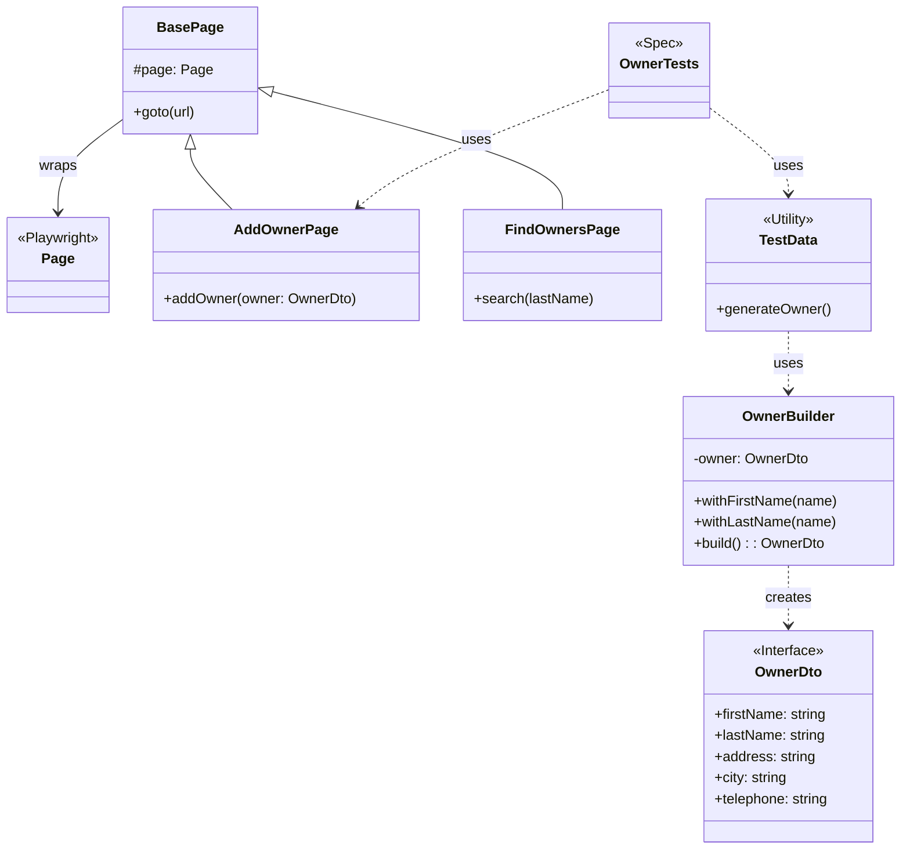

# Test Task - Playwright Test Framework

This repository contains automated end-to-end tests for the [Spring PetClinic](https://github.com/spring-projects/spring-petclinic) application using [Playwright](https://playwright.dev/).

## Prerequisites

- **Node.js**: (Latest LTS recommended)
- **Java**: Required to run the Spring PetClinic backend.
- **Spring PetClinic**: The `spring-petclinic` repository is expected to be a sibling directory to this project.
    ```
    /git
      /playwright-test-task (this repo)
      /spring-petclinic (application repo)
    ```

## Installation

Install the dependencies:

```bash
npm install
```

Install Playwright browsers:

```bash
npx playwright install
```

## Project Structure

The project follows the Page Object Model (POM) design pattern:

- **`pages/`**: Contains Page Object classes representing the web pages (e.g., `AddOwnerPage.ts`, `FindOwnersPage.ts`).
- **`tests/`**: Contains the test specifications (e.g., `owners.spec.ts`, `pets.spec.ts`).
- **`utils/`**: Helper classes and utilities.
  - **Builders**: `OwnerBuilder`, `PetBuilder`, `VisitBuilder` for fluent test data generation.
  - `test-data.ts`: Central export for data generation.
- **`models/`**: TypeScript interfaces defining the data structures (e.g., `OwnerDto`, `PetDto`).

## Architecture Diagram



## Running Tests

The configuration is set up to automatically start the backend server before running the tests.

Run all tests:

```bash
npx playwright test
```

Run a specific test file:

```bash
npx playwright test tests/owners.spec.ts
```

Run tests with UI mode (interactive):

```bash
npx playwright test --ui
```

### Configuration

The `playwright.config.ts` handles the test configuration. It is configured to:
- Launch the Spring PetClinic app from the sibling `../spring-petclinic` directory.
- Wait for port **8080** to be ready.
- Run tests in parallel (fully parallel mode is enabled).

## Test Data Generation

We use **Faker** and the **Builder Pattern** to generate dynamic test data.

Example usage in tests:

```typescript
// Create a default valid owner
const owner = generateOwner();

// Create a custom owner for validation testing using Builder
const invalidOwner = new OwnerBuilder()
    .withFirstName('') // Empty name to test validation
    .build();
```
